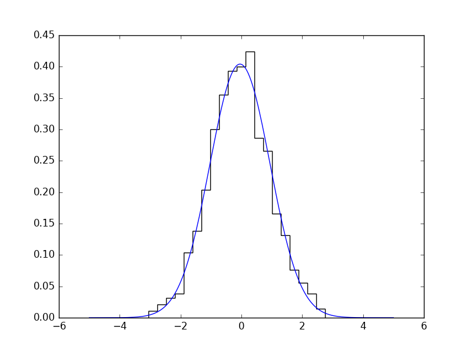
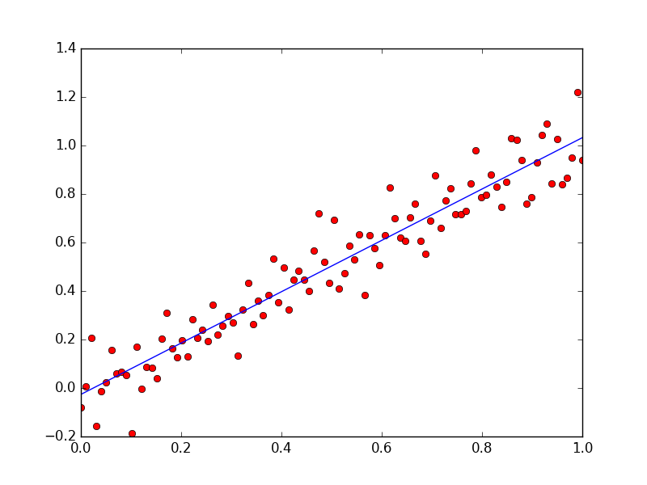
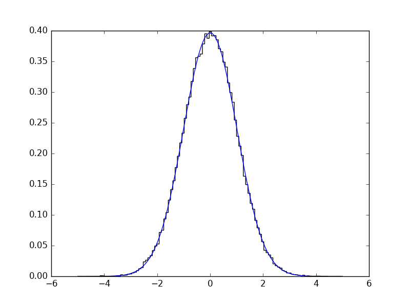

:warning: **TensorProb is no longer maintained and [`zfit`](https://github.com/zfit/zfit) has since emerged as an alternative.** :warning:

# TensorProb

[](https://travis-ci.org/tensorprob/tensorprob)
[](https://coveralls.io/github/tensorprob/tensorprob?branch=master)
[](https://tensorprob.github.io/tensorprob)
[](https://gitter.im/tensorprob/tensorprob)

TensorProb is a probabilistic programming framework based on
[TensorFlow](https://github.com/tensorflow/tensorflow).

It's a Python library that allows you to define random variables and complex
probabilistic relationships between them using basic building blocks.
If provided with observations of some of the variables, it allows you to infer the
values of the other (unobserved) ones.

TensorProb doesn't assume whether you want to use frequentist or bayesian
paradigms to perform the inference and provides tools for doing both.

The posterior distribution (or likelihood function) are constructed and
evaluated using TensorFlow, which means you can make use of multiple CPU cores
and GPUs simultaneously. This also makes it easy to add new custom probability
distributions by using the symbolic operators defined in TensorFlow.

See the Examples section further down to see how TensorProb can be used.

## Contributing to TensorProb

We happily accept contributions to the project!
Please have a look at [`CONTRIBUTING.md`](CONTRIBUTING.md) for instructions and guidelines.

## Installation

TensorProb needs TensorFlow (python 3.4 version). The preferred way to install is via anaconda: https://www.tensorflow.org/install/install_linux#installing_with_anaconda

In addition you need to install two packages into your respective conda env:
```
pip install colorlog
pip install numdifftools
```

In order to run the examples you need jupyter and a few other tools. Inside your conda env do:
```
conda uninstall ipython
conda install jupyter
conda install matplotlib
```

## Examples

The following examples are just a few small demonstrations. If you want to see
more involved examples with detailed explanations, you can take a look at the
Jupyter notebooks in the [`examples/`](examples/) directory.

### Normal distribution

This is an example for fitting a normal distribution to data:
```python
import numpy as np
from tensorprob import Model, Parameter, Normal

# Define the model
with Model() as model:
    mu = Parameter()
    sigma = Parameter(lower=0)
    X = Normal(mu, sigma)

# Declare variables for which we have data
model.observed(X)

# Set the initial values
model.initialize({
    mu: 10,
    sigma: 10,
})

# Create a dataset with Numpy
np.random.seed(0)
data = np.random.normal(0, 1, 1000)

# Perform the fit
model.fit(data)
print(model.state[mu]) # prints -0.0452568051055
```
The fitted distribution can be visualized using the `model.pdf` method
```python
import matplotlib.pyplot as plt
xs = np.linspace(-5, 5, 200)
plt.hist(data, bins=20, histtype='step', color='k', normed=True)
plt.plot(xs, model.pdf(xs), 'b-')
plt.show()
```
<div align="center"></div>

### Least squares fit

If we have a few noisy data points `(X, y)`, we can model their deviation from
a fit line with parameters `a` and `b` as a normally distributed random variable.
This is mathematically equivalent to a least squares fit.

The model can be expressed as
```python
from tensorprob import Model, Parameter, Normal

with Model() as model:
    a = Parameter()
    b = Parameter()
    sigma = Parameter(lower=0)
    X = Parameter()
    y = Normal(a * X + b, sigma)

model.observed(X, y)
model.initialize({
    a: 2,
    b: 2,
    sigma: 10,
})

import numpy as np
xs = np.linspace(0, 1, 100)
ys = 1 * xs + 0 +  np.random.normal(0, .1, len(xs))

results = model.fit(xs, ys)

import matplotlib.pyplot as plt
plt.plot(xs, ys, 'ro')
x_ = np.linspace(0, 1, 200)
# We use the model.state dict to access the values of a and b
plt.plot(x_, model.state[a] * x_ + model.state[b], 'b-')
plt.show()
```
<div align="center"></div>

### Sampling random values using MCMC

TensorProb models also have an `.mcmc` method that can be used to sample
estimates from the posterior distribution for performing bayesian inference.

This functionality can also be used to sample from a given probability
distribution:
```python
with Model() as model:
    X = Normal(0, 1)

# We're observed nothing, so X becomes a latent variable
model.observed()
model.initialize({ x: 0.5 })
np.random.seed(0)
chains = model.mcmc(samples=5000)
# Use a burn-in of 200 per chain and plot a histogram
plt.hist(out[:,200:].ravel(), histtype='step', color='k', bins=100, normed=True)
```
We can use TensorProb again to check if these random samples are indeed
distributed according to the given distribution:
```python
with Model() as model2:
    mu = Uniform()
    sigma = Uniform(lower=0)
    X = Normal(mu, sigma)

model2.observed(X)
model2.initialize({ mu: 1, sigma: 2 })
results = model2.fit(out[:,200:].ravel())
print(results.x) # prints [ 0.00408158  1.00614212]

xs = np.linspace(-5, 5, 200)
plt.plot(xs, model2.pdf(xs), 'b-')
plt.show()
```
<div align="center"></div>

